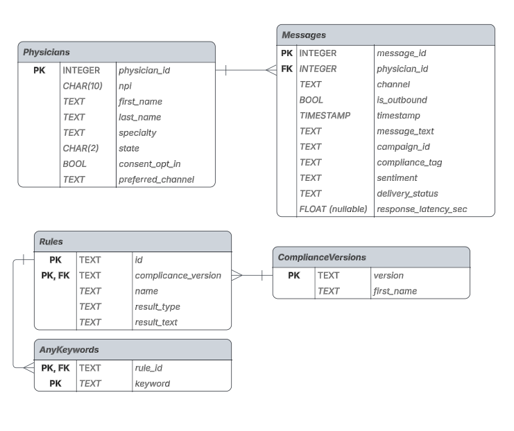

# Overview
Minimal fullstack app providing an interface to physician messages.
## Data

## Running
## Frontend
- TypeScript
- Next.js with react (compiled with)
### dev
## Backend
- Python
- FastAPI - backend framework
- SQLite - file based database
- SQLAlchemy (ORM) - interface with database
- pytest - testing HTTP framework
### dev
- `uv run -m db.manage migrate && uv run -m db.manage load` create database with initial data
- autoformatting (default options) done with [ruff](https://docs.astral.sh/ruff/formatter/)

